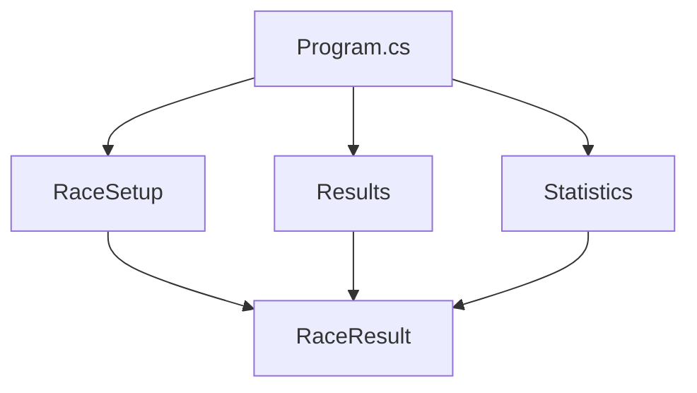
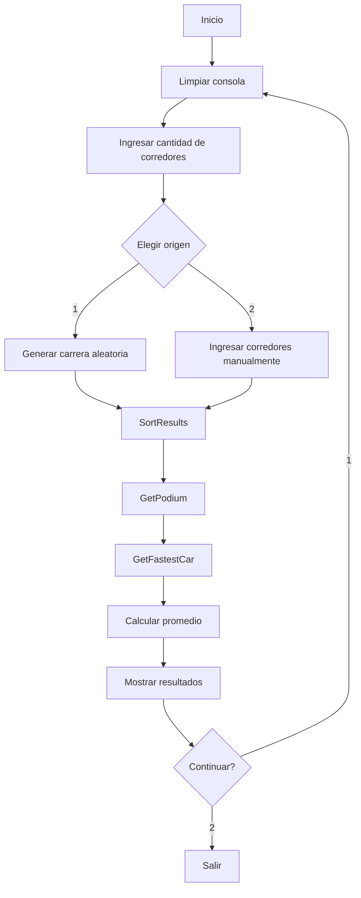

# Race Results

Aplicación de consola desarrollada en **C# y .NET 10** para procesar, ordenar y presentar los resultados de una carrera de autos.

El proyecto fue realizado como parte del **Primer Parcial de Estructura de Datos** de la Tecnicatura Universitaria en Videojuegos. Además de cumplir con los requisitos académicos, la solución fue organizada y documentada con foco en legibilidad, mantenibilidad, validación y pruebas automatizadas.

---

## Tabla de contenidos

- [Descripción](#descripción)
- [Objetivos del proyecto](#objetivos-del-proyecto)
- [Funcionalidades](#funcionalidades)
- [Requisitos académicos cubiertos](#requisitos-académicos-cubiertos)
- [Funcionalidades adicionales](#funcionalidades-adicionales)
- [Tecnologías](#tecnologías)
- [Arquitectura](#arquitectura)
- [Estructura del proyecto](#estructura-del-proyecto)
- [Componentes principales](#componentes-principales)
- [Algoritmos utilizados](#algoritmos-utilizados)
- [Modelo de datos](#modelo-de-datos)
- [Validaciones y reglas](#validaciones-y-reglas)
- [Flujo de ejecución](#flujo-de-ejecución)
- [Requisitos para ejecutar el proyecto](#requisitos-para-ejecutar-el-proyecto)
- [Instalación](#instalación)
- [Ejecución](#ejecución)
- [Cómo utilizar la aplicación](#cómo-utilizar-la-aplicación)
- [Ejemplo de ejecución](#ejemplo-de-ejecución)
- [Pruebas automatizadas](#pruebas-automatizadas)
- [Casos borde contemplados](#casos-borde-contemplados)
- [Decisiones de diseño](#decisiones-de-diseño)
- [Limitaciones actuales](#limitaciones-actuales)
- [Posibles mejoras futuras](#posibles-mejoras-futuras)
- [Licencia](#licencia)
- [Autor](#autor)

---

## Descripción

**Race Results** procesa una colección de resultados de carrera y permite:

- ordenar a los corredores por su posición final;
- construir un podio con los tres primeros puestos;
- identificar al corredor que realizó la vuelta más rápida;
- mostrar una tabla completa de resultados;
- formatear los tiempos en minutos y segundos;
- generar carreras automáticamente;
- ingresar resultados manualmente con validaciones;
- calcular el tiempo promedio de la carrera;
- ejecutar múltiples carreras sin reiniciar la aplicación.

La aplicación trabaja completamente en memoria y utiliza la consola como interfaz de entrada y salida.

---

## Objetivos del proyecto

El objetivo principal es resolver un problema de ranking aplicando conceptos de **estructuras de datos, búsqueda y ordenamiento**.

Los puntos centrales son:

1. representar cada resultado mediante una clase `RaceResult`;
2. ordenar los resultados por posición final;
3. obtener los tres integrantes del podio;
4. encontrar la vuelta más rápida;
5. presentar la información usando las plantillas indicadas por la consigna;
6. formatear correctamente los tiempos;
7. validar los datos ingresados;
8. mantener una implementación simple, clara y fácil de probar.

---

## Funcionalidades

### Procesamiento de resultados

- Ordenamiento por posición final.
- Podio de los tres primeros corredores.
- Identificación de la vuelta más rápida.
- Desempate determinista cuando dos corredores tienen el mismo tiempo de vuelta.
- Cálculo del tiempo promedio de carrera.

### Entrada de datos

La aplicación soporta dos estrategias:

1. **Generación aleatoria**
   - crea automáticamente una carrera válida;
   - genera números de auto únicos;
   - genera tiempos válidos;
   - asigna posiciones coherentes con los tiempos totales;
   - devuelve los corredores desordenados para que `SortResults()` realice el ordenamiento;
   - mantiene separada la posición final de la vuelta más rápida.

2. **Ingreso manual**
   - permite ingresar cada corredor desde consola;
   - valida todos los campos antes de aceptar un resultado;
   - vuelve a solicitar únicamente los datos inválidos.

### Presentación

Se muestran cuatro secciones:

```text
PODIUM
RACE RESULTS
FASTEST LAP
STATISTICS
```

Al finalizar una carrera, el usuario puede:

```text
1 - Continue
2 - Exit
```

Si se elige continuar, la consola se limpia y comienza una nueva carrera con estado completamente nuevo.

---

## Requisitos académicos cubiertos

| Requisito | Implementación |
|---|---|
| Clase `RaceResult` | `Domain/RaceResult.cs` |
| Posición final | `RaceResult.Position` |
| Número de auto | `RaceResult.CarNumber` |
| Nombre del corredor | `RaceResult.RacerName` |
| Tiempo total | `RaceResult.TotalTime` |
| Vuelta más rápida | `RaceResult.FastestLap` |
| `SortResults()` | Insertion Sort explícito |
| `GetFastestCar()` | Búsqueda lineal |
| `GetPodium()` | Reutiliza `SortResults()` y obtiene los tres primeros |
| Lista o arreglo como entrada | `IList<RaceResult>` |
| Plantilla de tabla | `RaceResultTemplates.RacerTable` |
| Plantilla de vuelta rápida | `RaceResultTemplates.FastestRacer` |
| Reemplazo de tokens | `RaceResultsConsolePresenter` |
| Formato minutos/segundos | `TimeFormatter` |
| Ejecución por consola | `Program.cs` + componentes de presentación |

Las plantillas utilizadas son:

```csharp
"{pos} | {car_numb} - {racer_name} | {total_time}"
```

```csharp
"The fastest car is {car_numb} with a time of {fastest_time}"
```

Los tokens se reemplazan explícitamente antes de mostrar cada línea.

---

## Funcionalidades adicionales

Además de los requisitos obligatorios, el proyecto incorpora:

- generación automática de resultados válidos;
- ingreso manual completo por consola;
- validación de entradas;
- detección de datos duplicados;
- cálculo del tiempo promedio de carrera;
- posibilidad de ejecutar varias carreras sin reiniciar la aplicación;
- pruebas automatizadas para lógica, validaciones y presentación.

---

## Tecnologías

### Producción

- **C#**
- **.NET 10**
- Aplicación de consola
- Nullable Reference Types
- Implicit Usings

### Testing

- **xUnit 2.9.3**
- **Microsoft.NET.Test.Sdk 18.8.1**
- **coverlet.collector 6.0.4**
- **xunit.runner.visualstudio 3.1.5**

No se utiliza:

- base de datos;
- Entity Framework;
- ASP.NET Core;
- framework de Dependency Injection;
- MediatR;
- almacenamiento externo.

El proyecto está diseñado deliberadamente como una aplicación pequeña y autocontenida.

---

# Arquitectura

El proyecto utiliza una arquitectura **feature-oriented** dentro de una única aplicación desplegable.

Puede describirse como un **monolito modular pragmático**:

```text
Program
  |
  +--> RaceSetup
  |      |
  |      +--> ManualRaceResultSource
  |      +--> RandomRaceResultSource
  |
  +--> Results
  |      |
  |      +--> RaceResultService
  |      +--> RaceResultTemplates
  |      +--> RaceResultsConsolePresenter
  |      +--> TimeFormatter
  |
  +--> Statistics
         |
         +--> RaceStatisticsService

Todos los módulos
        |
        v
Domain.RaceResult
```

La aplicación continúa siendo:

- un único ejecutable;
- un único proceso;
- una única unidad de despliegue.

La separación interna existe para mantener responsabilidades claras, no para agregar complejidad innecesaria.

---

## Flujo de dependencias



`Program.cs` funciona como **Composition Root**: crea las dependencias concretas y coordina el flujo general de la aplicación.

La lógica de ordenamiento, búsqueda, presentación, validación y estadísticas no se encuentra mezclada dentro del entry point.

---

## Strategy Pattern

La obtención de resultados utiliza una pequeña implementación del patrón **Strategy** mediante:

```csharp
IRaceResultSource
```

con dos implementaciones:

```text
IRaceResultSource
├── ManualRaceResultSource
└── RandomRaceResultSource
```

De esta manera, `Program.cs` puede seleccionar la forma de obtener los resultados sin modificar la lógica de procesamiento de la carrera.

No se creó una interfaz para cada clase. La abstracción se utiliza solamente donde existen dos estrategias reales e intercambiables.

---

## Estructura del proyecto

```text
RaceResult/
├── LICENSE
└── RaceResults/
    ├── .gitignore
    ├── RaceResults.slnx
    │
    ├── RaceResults/
    │   ├── RaceResults.csproj
    │   ├── Program.cs
    │   │
    │   ├── Domain/
    │   │   └── RaceResult.cs
    │   │
    │   └── Features/
    │       ├── RaceSetup/
    │       │   ├── IRaceResultSource.cs
    │       │   ├── ManualRaceResultSource.cs
    │       │   ├── RaceSetupConsole.cs
    │       │   ├── RaceSetupRules.cs
    │       │   └── RandomRaceResultSource.cs
    │       │
    │       ├── Results/
    │       │   ├── RaceResultService.cs
    │       │   ├── RaceResultTemplates.cs
    │       │   ├── RaceResultsConsolePresenter.cs
    │       │   └── TimeFormatter.cs
    │       │
    │       └── Statistics/
    │           └── RaceStatisticsService.cs
    │
    └── tests/
        └── RaceResults.Tests/
            ├── RaceResults.Tests.csproj
            ├── TestData.cs
            ├── Usings.cs
            └── Features/
                ├── RaceSetup/
                ├── Results/
                └── Statistics/
```

---

# Componentes principales

## `RaceResult`

Modelo que representa el resultado de un corredor.

Contiene:

```csharp
Position
CarNumber
RacerName
TotalTime
FastestLap
```

No contiene lógica de consola, generación aleatoria ni presentación.

---

## `RaceResultService`

Contiene la lógica central del parcial:

```csharp
SortResults()
GetFastestCar()
GetPodium()
```

También valida que los resultados procesados sean consistentes.

---

## `RaceResultTemplates`

Contiene las plantillas originales utilizadas para mostrar:

- cada resultado;
- la vuelta más rápida.

Esto permite mantener la salida definida por la consigna separada de la lógica de presentación.

---

## `RaceResultsConsolePresenter`

Responsable de escribir la información en consola:

- podio;
- tabla completa;
- vuelta más rápida;
- estadísticas.

También realiza el reemplazo explícito de los tokens de las plantillas.

---

## `TimeFormatter`

Convierte tiempos almacenados como segundos a:

```text
mm:ss
```

Ejemplos:

```text
68 segundos  -> 01:08
316 segundos -> 05:16
```

Los valores se redondean al segundo entero más cercano antes de ser formateados.

---

## `IRaceResultSource`

Contrato utilizado para obtener una colección de resultados.

```csharp
List<RaceResult> CreateResults(int racerCount);
```

Sus implementaciones son:

- `ManualRaceResultSource`
- `RandomRaceResultSource`

---

## `ManualRaceResultSource`

Permite crear una carrera ingresando cada corredor manualmente.

Valida:

- posición;
- número de auto;
- nombre;
- tiempo total;
- vuelta más rápida;
- duplicados;
- rangos numéricos.

---

## `RandomRaceResultSource`

Genera automáticamente una carrera válida.

Entre otras reglas:

- genera números de auto únicos;
- genera tiempos totales válidos;
- asigna las posiciones a partir de los tiempos totales;
- fuerza que la vuelta más rápida pueda pertenecer a un corredor diferente del ganador;
- desordena la colección antes de retornarla.

Esto permite demostrar que:

```text
ganador de la carrera != corredor con la vuelta más rápida
```

y que `SortResults()` efectivamente tiene que ordenar los datos.

---

## `RaceSetupConsole`

Centraliza la interacción inicial con el usuario:

- cantidad de corredores;
- selección de origen de datos;
- continuar o salir.

---

## `RaceSetupRules`

Contiene reglas compartidas de configuración:

```text
Cantidad mínima de corredores: 3
Cantidad máxima de corredores: 20
Número mínimo de auto: 1
Número máximo de auto: 999
```

---

## `RaceStatisticsService`

Implementa una funcionalidad adicional:

```csharp
GetAverageTotalTime()
```

Calcula el promedio de los tiempos totales de todos los corredores.

---

# Algoritmos utilizados

## Insertion Sort

`SortResults()` implementa **Insertion Sort** explícitamente.

La colección original no se modifica. Primero se crea una copia:

```text
IList<RaceResult>
        |
        v
List<RaceResult> copy
        |
        v
Insertion Sort
        |
        v
lista ordenada por Position
```

Cada corredor se compara con los elementos ubicados a su izquierda y se desplazan los elementos necesarios hasta encontrar su posición correcta.

### Complejidad

| Caso | Complejidad |
|---|---:|
| Mejor caso | O(n) |
| Caso promedio | O(n²) |
| Peor caso | O(n²) |
| Memoria adicional | O(n) por la copia |

Para un scoreboard pequeño de entre 3 y 20 corredores, esta solución es simple y adecuada.

---

## Búsqueda lineal

`GetFastestCar()` realiza una búsqueda lineal.

```text
primer corredor
      |
      v
fastestCar
      |
      v
recorrer corredores restantes
      |
      v
comparar FastestLap
      |
      v
conservar el mejor resultado
```

### Complejidad

```text
O(n)
```

No se utiliza búsqueda binaria porque la colección no está ordenada por `FastestLap` y el objetivo es encontrar el mínimo recorriendo un conjunto pequeño de resultados.

---

## Desempate de vuelta rápida

Si dos corredores tienen exactamente la misma vuelta rápida:

1. se prioriza la mejor posición final;
2. si aún existe empate, se prioriza el número de auto menor.

Esto garantiza un resultado determinista.

---

## Podio

`GetPodium()`:

1. valida que existan al menos tres corredores;
2. reutiliza `SortResults()`;
3. toma los tres primeros resultados.

No duplica el algoritmo de ordenamiento.

---

# Modelo de datos

La entidad principal es:

```csharp
public sealed class RaceResult
{
    public int Position { get; set; }
    public int CarNumber { get; set; }
    public string RacerName { get; set; }
    public float TotalTime { get; set; }
    public float FastestLap { get; set; }
}
```

Los tiempos se almacenan internamente como segundos.

Ejemplo:

```text
TotalTime  = 316
FastestLap = 69
```

se presenta como:

```text
TotalTime  -> 05:16
FastestLap -> 01:09
```

---

# Validaciones y reglas

## Cantidad de corredores

Debe estar entre:

```text
3 y 20
```

## Posición final

Debe ser un entero entre `1` y la cantidad de corredores y no puede repetirse.

## Número de auto

Debe ser un entero entre `1` y `999` y no puede repetirse.

## Nombre

Debe contener al menos un carácter distinto de espacios.

## Tiempo total

Debe ser numérico, finito y mayor a `0`.

## Vuelta más rápida

Debe ser numérica, finita, mayor a `0` y menor o igual al tiempo total.

## Entrada inválida

Los errores de entrada no terminan la aplicación. El sistema vuelve a solicitar el dato.

---

# Flujo de ejecución



Cada nueva carrera utiliza estado nuevo.

---

# Requisitos para ejecutar el proyecto

## Obligatorio

- **.NET 10 SDK**

Comprobar:

```bash
dotnet --version
```

## Opcional

- Visual Studio con soporte para .NET 10.
- JetBrains Rider.
- Visual Studio Code con C# Dev Kit.
- Git.

---

# Instalación

```bash
git clone https://github.com/EmilianoBazanZapata/RaceResult.git
cd RaceResult/RaceResults
dotnet restore RaceResults.slnx
dotnet build RaceResults.slnx -c Release
```

---

# Ejecución

```bash
dotnet run --project RaceResults/RaceResults.csproj
```

También puede abrirse `RaceResults.slnx` desde un IDE compatible.

---

# Cómo utilizar la aplicación

Al iniciar:

```text
========================================
              RACE RESULTS
========================================

Number of racers (3-20):
```

Ingresar, por ejemplo:

```text
3
```

Después elegir:

```text
1 - Generate random race
2 - Enter racers manually
```

## Carrera aleatoria

Elegir:

```text
1
```

## Ingreso manual

Elegir:

```text
2
```

Por cada corredor se solicitará posición, número de auto, nombre, tiempo total y vuelta más rápida.

---

# Ejemplo de ejecución

```text
========================================
                 PODIUM
========================================
1st | #27 | Emiliano | 05:16
2nd | #11 | Sofia | 05:20
3rd | #44 | Mateo | 05:27

========================================
              RACE RESULTS
========================================
1 | 27 - Emiliano | 05:16
2 | 11 - Sofia | 05:20
3 | 44 - Mateo | 05:27

========================================
              FASTEST LAP
========================================
The fastest car is 11 with a time of 01:08

========================================
               STATISTICS
========================================
Average race time: 05:21

Race processing complete.

1 - Continue
2 - Exit
```

---

# Pruebas automatizadas

El proyecto incluye una suite de pruebas con **xUnit**.

Ejecutar:

```bash
dotnet test RaceResults.slnx -c Release
```

La suite cubre:

- ordenamiento;
- arrays y listas;
- preservación del input;
- vuelta más rápida;
- desempates;
- podio;
- validaciones;
- formato de tiempos;
- reemplazo de tokens;
- generación aleatoria;
- entrada manual;
- estadísticas;
- continuar/salir;
- entradas inválidas.

---

# Casos borde contemplados

- colección nula;
- colección vacía;
- menos de tres corredores;
- cantidad fuera de rango;
- posiciones duplicadas;
- números de auto duplicados;
- nombres vacíos;
- tiempos iguales a cero;
- tiempos negativos;
- `NaN`;
- infinito;
- vuelta rápida mayor al tiempo total;
- empate en vuelta rápida;
- texto donde se espera un número;
- final inesperado de entrada;
- múltiples carreras consecutivas.

---

# Decisiones de diseño

## Una sola aplicación

El alcance no justifica múltiples proyectos de producción. Se utiliza un único ejecutable con módulos internos por feature.

## Lista como estructura principal

El scoreboard tiene entre 3 y 20 corredores, por lo que una colección simple resulta suficiente.

## Insertion Sort explícito

Se implementa el algoritmo directamente en lugar de ocultarlo detrás de `OrderBy()` para mantener el objetivo académico visible.

## Búsqueda lineal

Encontrar el mínimo requiere una sola pasada `O(n)`.

## Estado aislado por carrera

Cada iteración crea sus propios resultados; una carrera anterior no contamina la siguiente.
---

# Licencia

Este proyecto utiliza la licencia **MIT**. Consultar `LICENSE` para los términos completos.
